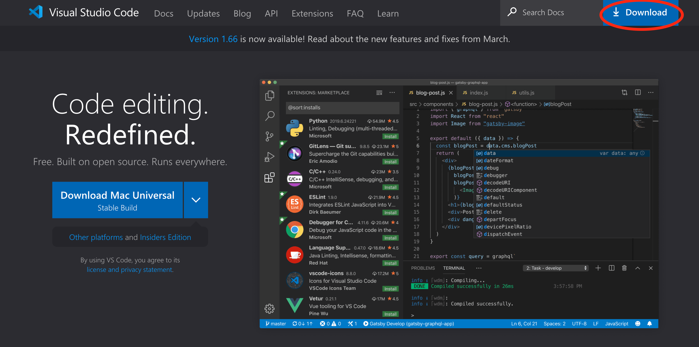
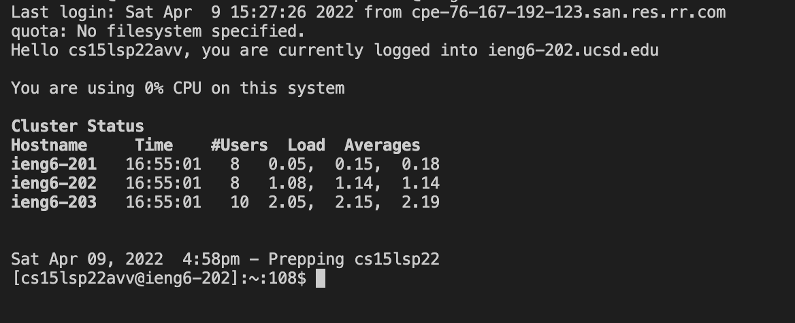
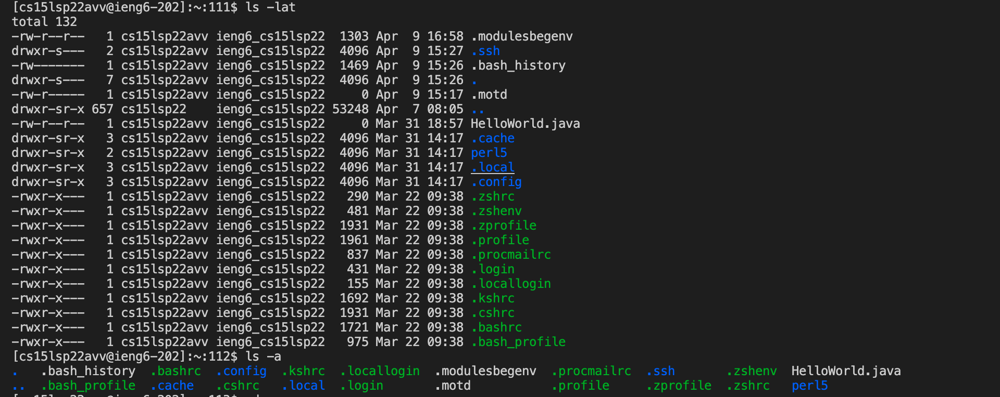
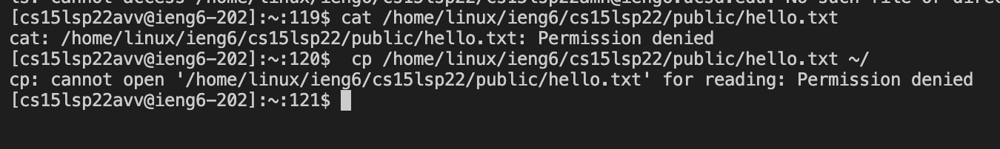
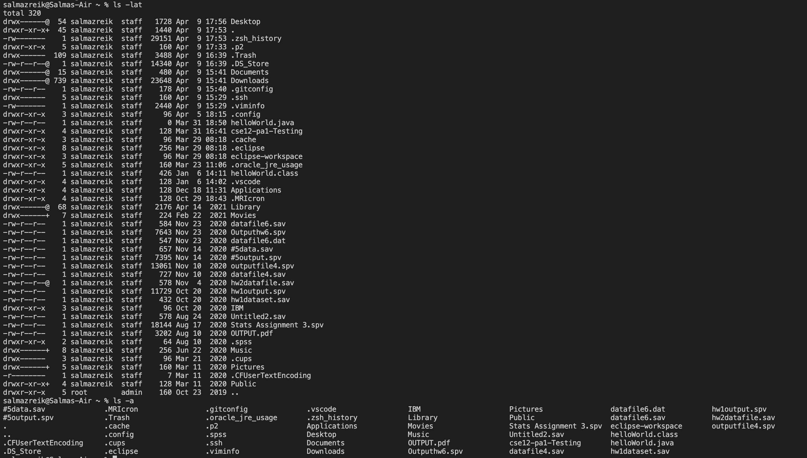
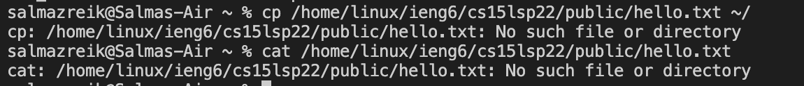
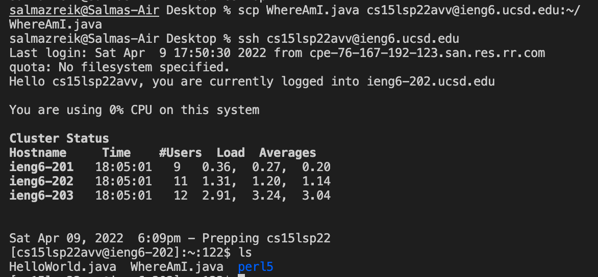
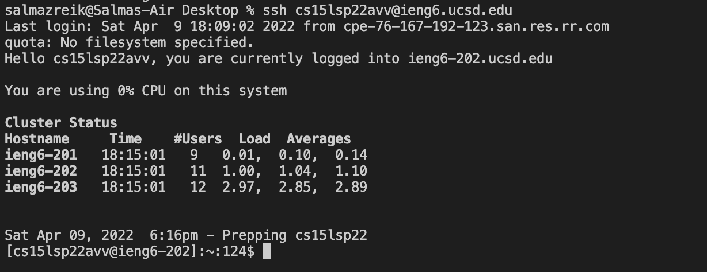
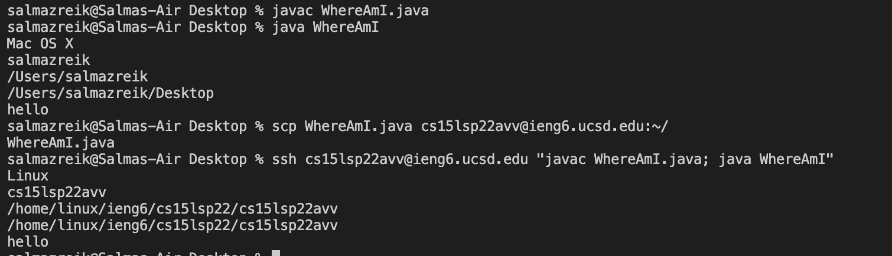

# Lab Report 1
## Installing VScode
1. Go to the [Visual Studio Code website.](https://code.visualstudio.com/)
2. Click the "Download" button pictured below, and choose the appropriate download corresponding to your operating system.

3. Follow the application's instructions for installation.

## Remotely Connecting
1. If you are on Windows, install the [OpenSSH](https://docs.microsoft.com/en-us/windows-server/administration/openssh/openssh_install_firstuse) program. If you are on Mac, ignore this step and proceed to Step 2.
2. Look up your course specific account by entering the information on [this website](https://sdacs.ucsd.edu/~icc/index.php).
3. Open VScode and open a terminal by clicking "Terminal" in top menu and then selecting new terminal.
4.  Enter the following command into the terminal, replacing `XX` with the appropriate letters from your course specific account.

    `ssh cs15lsp22zXX@ieng6.ucsd.edu`

5. If you get a message that reads:

    `The authenticity of host 'ieng6.ucsd.edu (128.54.70.227)' can't
be established.
RSA key fingerprint is
SHA256:ksruYwhnYH+sySHnHAtLUHngrPEyZTDl/1x99wUQcec.
Are you sure you want to continue connecting
(yes/no/[fingerprint])?`

    Enter `yes` into the terminal.

6. Enter your password, and if you see the following screen you are connected!

## Trying Some Commands
 1. Try the `ls -lat` and `ls -a` commands on the remote server.
 
 2. Try the `cp /home/linux/ieng6/cs15lsp22/public/hello.txt ~/`  and ` cat /home/linux/ieng6/cs15lsp22/public/hello.txt` commands on the remote server.
 
 3. Try the `ls -lat` and `ls -a` commands on client.
 
 4. Try the `cp /home/linux/ieng6/cs15lsp22/public/hello.txt ~/`  and ` cat /home/linux/ieng6/cs15lsp22/public/hello.txt` on client.
 

## Moving Files With `scp`
1. Put java file (in this case, WhereAmI.java) onto your computer.
2. Enter `scp WhereAmI.java cs15lsp22XX@ieng6.ucsd.edu:~/` into the terminal on client, again replacing `XX` with the appropriate letters from your course specific account.
3. Use ssh to enter remote server.
4. Use command `ls` to check if file (WhereAmI.java) is in ssh.

## Setting An SSH Key
1. Enter `ssh-keygen` into terminal on server. 
2. When prompted with `Enter file in which to save the key`, enter `/Users/<user-name>/.ssh/id_rsa` replacing `<username>` with the appropriate one on your client. 
3. Enter an empty space bar twice when prompted with `Enter passphrase (empty for no passphrase):`.
4. If you are on Windows, [use these intructions](https://docs.microsoft.com/en-us/windows-server/administration/openssh/openssh_keymanagement#user-key-generation) to complete an extra step. If you are on Mac, ignore this step and proceed to Step 5. 
5. Enter remote server and enter command `mkdir .ssh`. Exit server.
6. On client, enter `scp/Users<user-name>/.ssh/id_rsa.pub
cs15lsp22XX@ieng6.ucsd.edu:~/.ssh/authorized_keys`, replacing `<user-name>` and `XX` with appropriate inputs.
7. Test if you can login without needing a password.

## Optimizing Remote Running
1. For copying a local edit in WhereAmI.java to the server and running it, first enter 

    `scp WhereAmI.java cs15lsp22avv@ieng6.ucsd.edu:~/` into the terminal, followed by 
    
    `ssh cs15lsp22avv@ieng6.ucsd.edu "javac WhereAmI.java; java WhereAmI"` and you should see it run. 

(Here one can see the commands making the file run on the server, with the last line `"hello"` being the local edit. )

---

[**Back to Homepage**](https://szreik.github.io/cse15l-lab-reports)