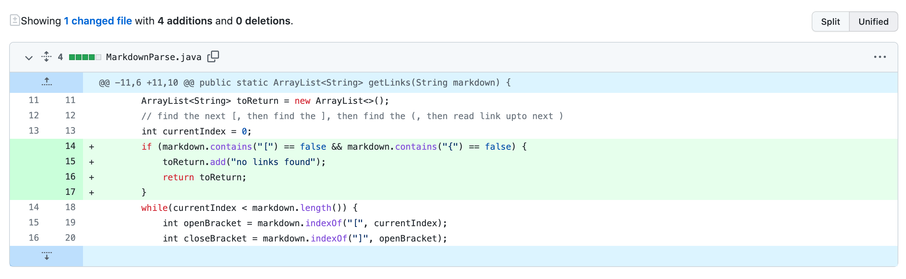
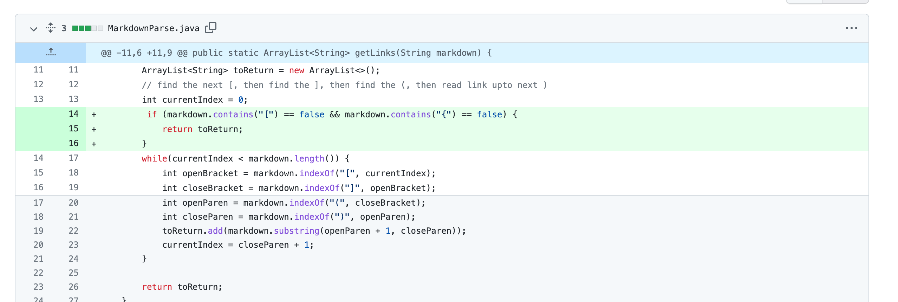
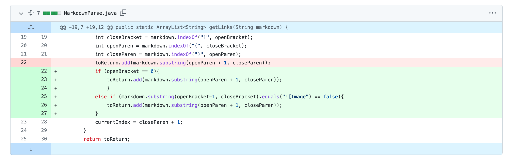
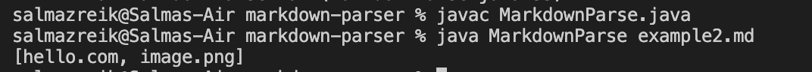
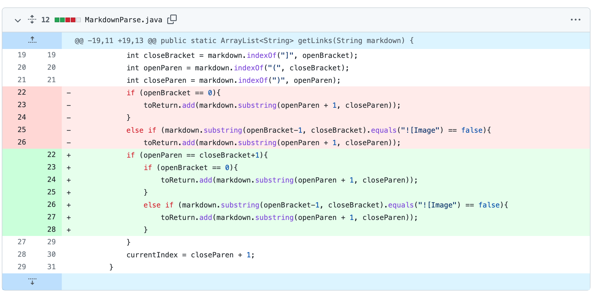
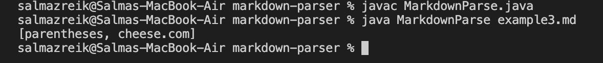

# Lab Report 2
## First Code Change
1. Code change difference: 
2. [Link to file with failure-inducing input](https://szreik.github.io/cse15l-lab-reports/example.html)
3. Symptom of failure-inducing input: 
4. The failure-inducing input is a file with no links. This input causes the symptom of an `IndexOurOfBoundsException`. This occurs due to the bug of the program not considering what happens when there is no parentheses/ brackets (no links) in the file, which would cause the indexOf method to return a -1 and then make the substring method search for the -1 position, which returns an `IndexOutOfBoundsExcetption`.

## Second code change
1. Code change difference: 
2. [Link to file with failure-inducing input](https://szreik.github.io/cse15l-lab-reports/example2.html)
3. Symptom of failure-inducing input: 
4. The failure inducing input is a file that has an image. The symptom is that the getLinks method includes the name of the image in the return list. The bug is that the image and link syntax for Markdown both includes brackets and parentheses and the code doesn't differentiate between the two.

## Third code change
1. Code change difference: 
2. [Link to file with failure-inducing input](https://szreik.github.io/cse15l-lab-reports/example3.html)
3. Symptom of failure-inducing input: 
4. The failure inducing input is a file that has brackets and parentheses far away from each other. The symptom is that the getLinks method includes the contents that are in the parentheses in the return list, even though it is not a link. The bug is that the the code doesn't consider the case when there is distance in between the brackets and the parentheses. In Markdown, this would not be the way to format a link and it wouldn't read it as a link but the program did consider this case a link.