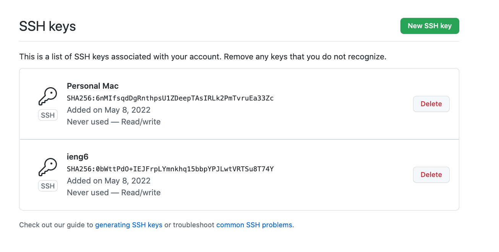
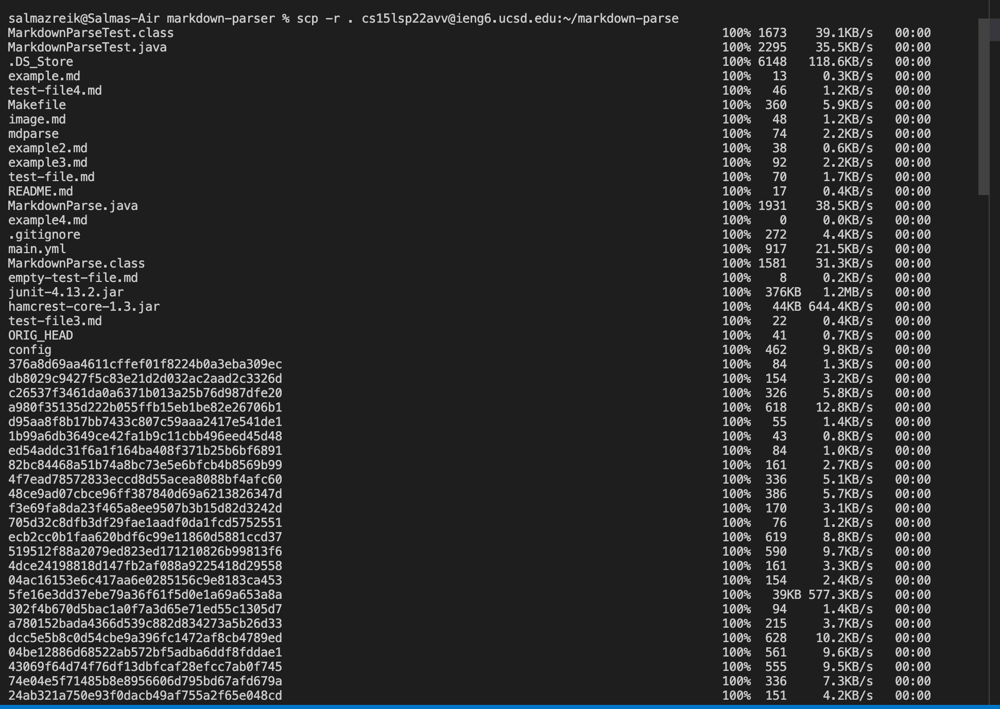
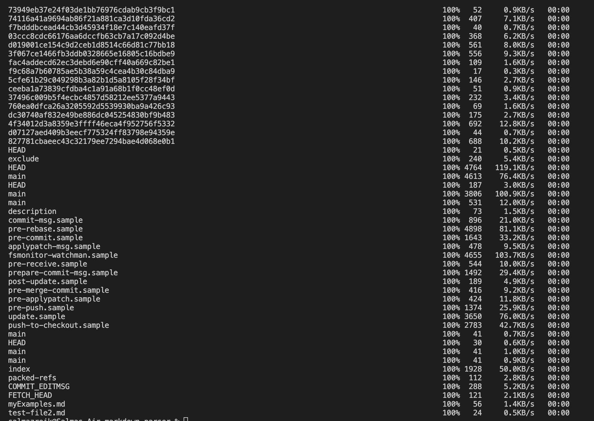

# Lab Report 3

## Streamlining SSH Configuration
1. `.ssh/config` file, edited by entering `open -t config` in the command line and opening and editing the file through TextEdit.

2. `ssh` command logging me into my account using just the alias.

3. `scp` command copying a file to my account using just the
alias is underlined in red. You can see that MyFile.txt is not in server before using this scp command, and it is in the server afterwards.

## Setting up Github Access from ieng6
1. Public key stored on Github

Public key stored in my user account

2. Private key in my user account

3. Running git commands to commit and push chanegs to Github from ieng6 account

4. [Link to resulting commit](https://github.com/szreik/markdown-parser/commit/b3fb7996e3b4ec61d1bfc9b8901a7968176223fc)

## Copy whole directories with `scp -r`
1. Copying whole markdown-parse directory to my ieng6
account (it took two pictures to capture all the files saved)

2. Logging into my ieng6 account after doing this and compiling and running the tests for my repository

3. Show combining scp, ;, and ssh to copy the whole directory and run the tests in one line

