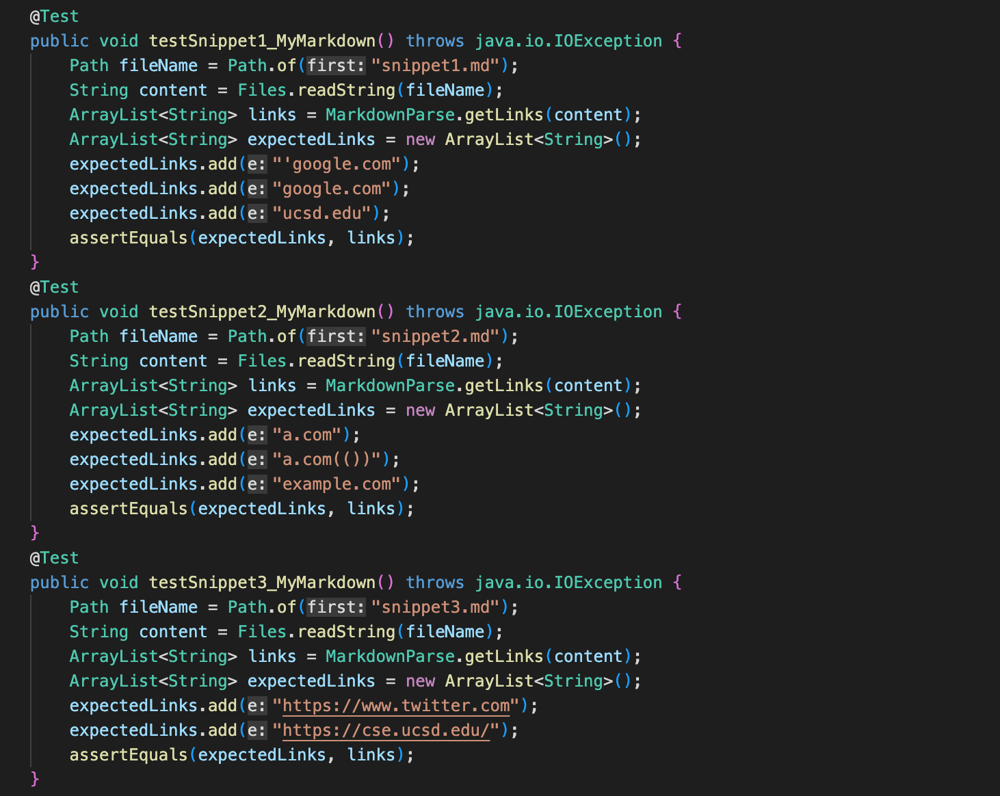
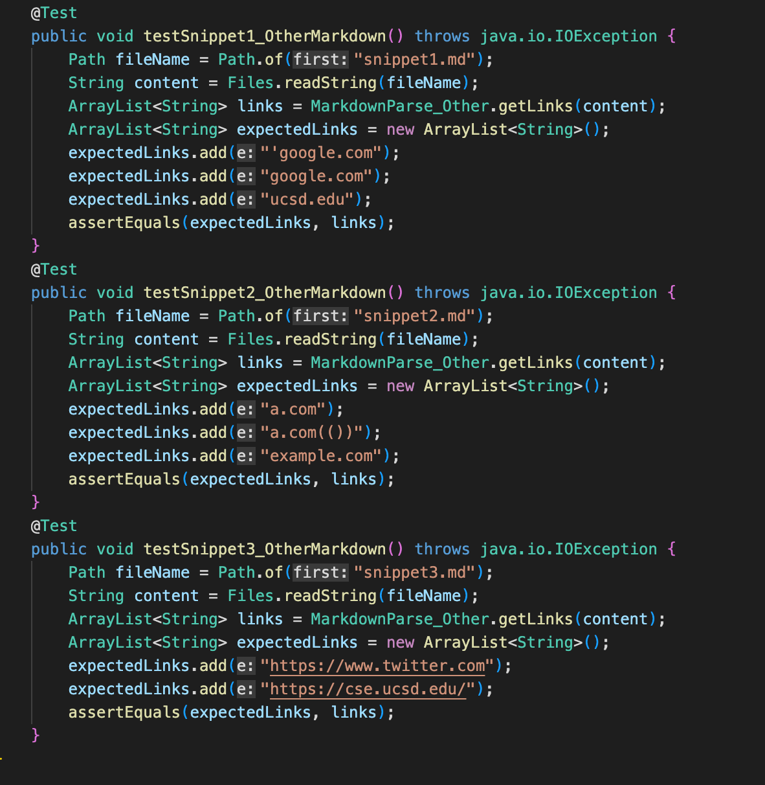
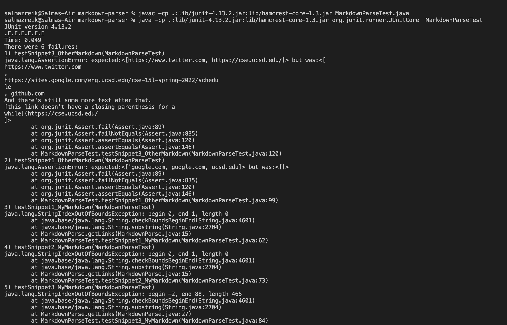
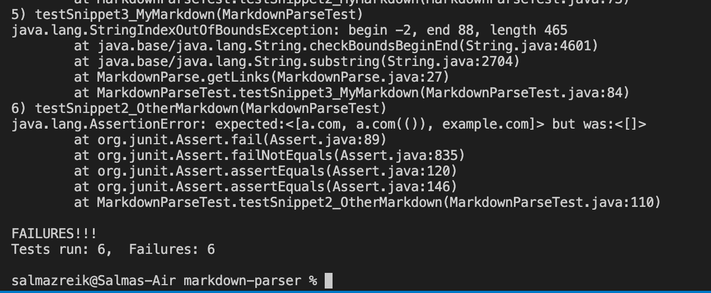

# Lab Report 4

1. [Link to my markdown repository](https://github.com/szreik/markdown-parser)

    [Link to repository we reviewed in Week 7](https://github.com/zayverrulez/markdown-parser)

2. Expected output for Snippet 1: `{'google.com, google.com, ucsd.edu}`
    
    Expected output for Snippet 2: `{a.com, a.com(()), example.com}`

    Expected output for Snippet 3: `{https://www.twitter.com, https://cse.ucsd.edu/}`
3. Making the tests to match expected outputs for my implementation and the one reviewed in week 7.

4. All 6 tests failed

5. For Snippet 1, I think this change could be achieved with a couple lines of code. The first change would be removing lines 15-17 to get rid of the indexOutofBounds error. Then, one could add a condition in the getLinks method that will ignore parentheses and brackets that have a backtick placed directly before the parentheses/bracket.

    For Snippet 2, I think the change to make this pass could require more than 10 lines of code. First, we should remove lines 15-17 to get rid of the indexOutofBounds error. Then, one would have to add some conditions after the openBracket variable is set where the code searches for any other open brackets and counts the amount, then searches for closeParen after we have found as many close brackets as open brackets that were counted after the inital openBracket variable. This same logic should be done for the parentheses variables.

    For Snippet 3, I think this 
---

[**Back to Homepage**](https://szreik.github.io/cse15l-lab-reports)