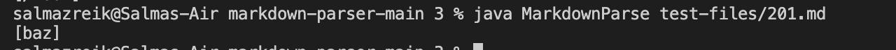
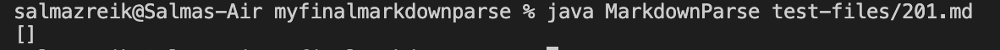
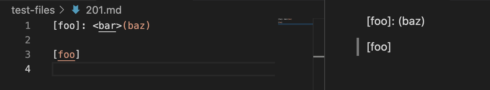
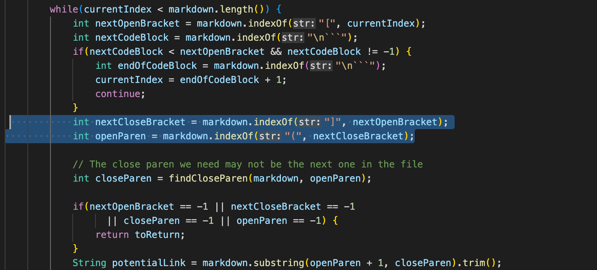
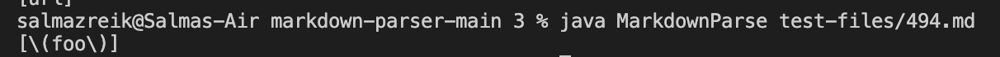
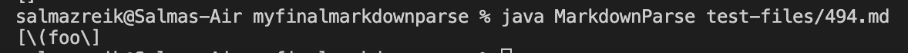
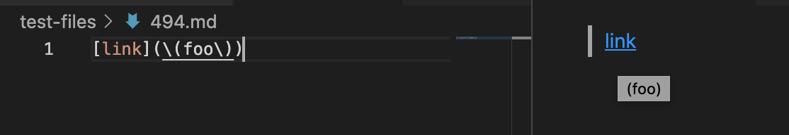
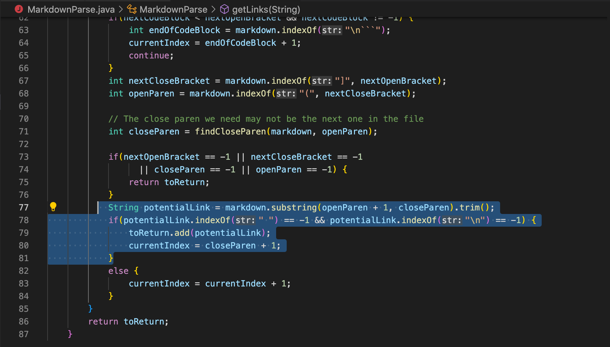

# Lab Report 5
1. To find the tests with different results, I manually searched through the result.txt files I created by running the script and using output redirection.
2. [First test file with different results](https://github.com/nidhidhamnani/markdown-parser/blob/main/test-files/201.md)

    [Second test file with different results](https://github.com/nidhidhamnani/markdown-parser/blob/main/test-files/494.md)
3. For the first test file, 201.md:
- My implementation produced the correct result. The provided class implementation was incorrect. 
- The result from the provided implementation: 
- The result from my own implementation: 
- The expected list of links should be an empty list, with no links. You can see this should be the expected output based on the VSCode preview. 
- The problem in the class implementation is that it does not check if the close bracket is right next to (aka the next index after) the open parentheses. The code could be changed by adding an if statement after the highlighted portion of code pictured below, that checks if the index of open parentheses is close bracket index+1. 
4. For the second test file, 494.md:
- Both implementations produced an incorrect result.
The result from the provided implementation: 
- The result from my own implementation: 
- The expected list of links should have one link in it, and it should be `(foo)`. You can see this should be the expected output based on the VSCode preview 
- The problem with both implementations is that they don't account for the use of a back-slash followed by a parentheses, which allows for parentheses to be included in the link without escaping the URL parentheses. These backslashes are not supposed to show up in the link, but both of these implementations include a back-slash. For the provided class implementation, the highlighted portions of code pictured below could be changed to search for and remove any backslashes from the given URL. 
---

[**Back to Homepage**](https://szreik.github.io/cse15l-lab-reports)